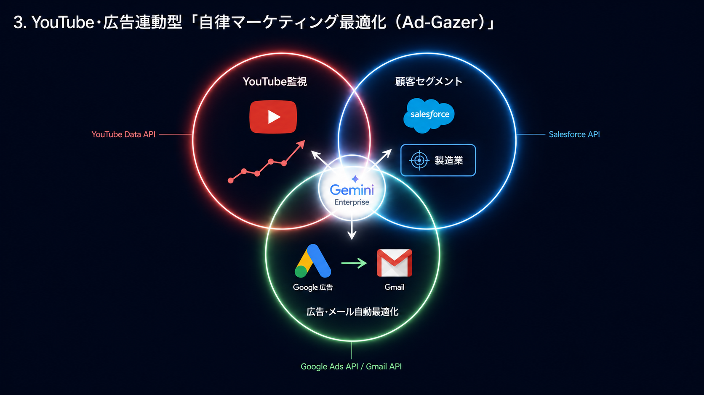

3. YouTube・広告連動型「自律マーケティング最適化（Ad-Gazer）」
YouTube動画の反響や市場のトレンドを24時間監視し、Google広告の運用とSalesforce（顧客管理）のシナジーを最大化するマーケターエージェント。

課題: 自社のYouTube動画や広告のパフォーマンス分析、それを受けたターゲット選定を手動で行うのはタイムラグが大きい。

AIエージェントの振る舞い:

YouTube API: 自社チャンネルの動画コメントや再生数の急上昇、あるいは競合のトレンド動画を自律的に監視・分析。

Gemini（推論）: 「現在、〇〇というキーワードの関心が高まっている。Salesforce内の『製造業』の顧客に刺さるはず」と判断。

Google 広告 / Gmail: Google広告のキーワード設定を自律的にチューニングしつつ、Salesforceの該当顧客セグメントに向けて、関連するYouTube動画を埋め込んだインサイドセールスメール（Gmail）を一斉送信するワークフローを自律実行。

技術スタック:

実行: Cloud Run + Cloud Scheduler

AI: Gemini Enterprise Agent Platform（マルチモーダルな動画・テキスト解析）

Google連携: YouTube Data API, Google Ads API, Gmail API

https://gemini-ops-orchestrator.web.app/Ad-Gazer/demo.html
