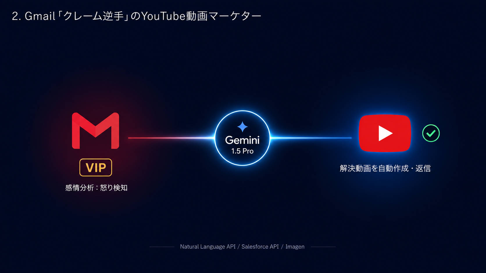

# 🚀 プロジェクト名：Claim-Converter（クレーム・コンバーター）

**〜 Gmail「クレーム逆手」の自律型YouTube動画マーケター 〜**

## 💡 設定した課題とその背景

カスタマーサポートにおいて、顧客からの「怒り・不満」のメール（クレーム）への対応は最も迅速かつ慎重な判断が求められる領域です。しかし、人間のサポート担当者が文面を読み解き、原因を調査し、分かりやすい解決策を提示するまでには多くの時間と精神的コストがかかります。

対応の遅れは顧客の離脱（チャーン）を招く一方、「ピンチはチャンス」の言葉通り、この瞬間に期待を大きく超える最高品質の体験を提供できれば、怒っている顧客を熱狂的なファン（ロイヤルカスタマー）へと転換できる可能性を秘めています。

## 🤖 AIエージェントの自律的な振る舞い（価値の中心）

本プロダクトは、届いたクレームの深刻度や顧客の重要度を瞬時に自律判定し、**その顧客の問題を「1分で解決する専用の解説YouTube動画」を自動で選定・生成して即座に返信する、超攻撃型の顧客防衛エージェント**です。

1. **Gmail (Pub/Sub) と感情分析によるクレームの超高速自律検知**
顧客からの新着メールをGmail API (Pub/Sub) で24時間常時監視。**Natural Language AI API**による感情分析をバックグラウンドで実行し、スコアが一定以上の「怒り・不満」を検知した瞬間に、人間の手を煩わせることなく即座に処理を開始します。
2. **Salesforce連携による「顧客重要度」のコンテキスト付与**
送信者のメールアドレスをキーに、Salesforce（Account/Contactオブジェクト）を自動検索。年間取引額や現在の契約プラン、過去のサポート履歴を確認し、Geminiに「この顧客はVIPです。最優先かつ極めて丁寧な対応を」といった、組織の力学に応じたコンテキスト（前提条件）を自律的に付与します。
3. **Geminiによる問題特定と「専用YouTube動画」の自律選定・生成**
Gemini 1.5 Proがメール文面から「何が問題か（例：システムログインのエラー、操作手順の不明）」を正確に特定。**YouTube Data API**を叩いて過去のヘルプ動画から最適なものを検索します。
* **💡 ハッカソン最大の魅せ所（自律生成）：** もし適切な動画が存在しない場合、Geminiが即座に解決スクリプト（台本）を執筆。**Imagen API**や音声合成（Text-to-Speech）を組み合わせ、「〇〇様へ。お困りの件の解決手順です」というパーソナライズされたスライド動画風の「限定公開動画」を自律生成し、YouTubeへ自動アップロードします。

4. **誠実な自動返信とSalesforceへの活動自動記録**
生成・選定された動画のURLを埋め込んだ、非の打ち所がない誠実な返信メールの「下書き」をGmail上に自律作成（または自動送信）。同時に、Salesforceの活動履歴（ActivityHistory）へ「クレーム対応：パーソナライズ動画送付済」と自動記録し、社内共有を完了させます。

## ⚙️ 技術スタックと選定理由（実装力）

非同期のイベント駆動型アーキテクチャと、マルチモーダル生成AIを融合させた先進的な構成です。

* **実行環境：Cloud Functions**
* *選定理由:* Gmailの着信（Pub/Subイベント）をトリガーとして、完全なサーバーレス環境でミリ秒単位の超高速な初期応答・感情分析のライフサイクルを回すため。

* **AI・メディア生成：Gemini 1.5 Pro & Imagen API & Text-to-Speech API**
* *選定理由:* 顧客の怒りの文面から本質的な問題を見抜く高度な推論力（Gemini）と、不足している視覚的・聴覚的解決リソースをオンデマンドで即座に錬成する（Imagen/TTS）マルチモーダルな連携を実現するため。

* **Googleサービス連携：Gmail API, YouTube Data API, Cloud Pub/Sub**
* *選定理由:* 大量に届くビジネスメールの取りこぼしを防ぐ強固なキューイング（Pub/Sub）と、世界最大の動画プラットフォームであるYouTubeを企業のサポートインフラとして完全に自動制御するため。

---

### 🌐 デモサイトURL

https://gemini-ops-orchestrator.web.app/Claim-Converter/demo.html
