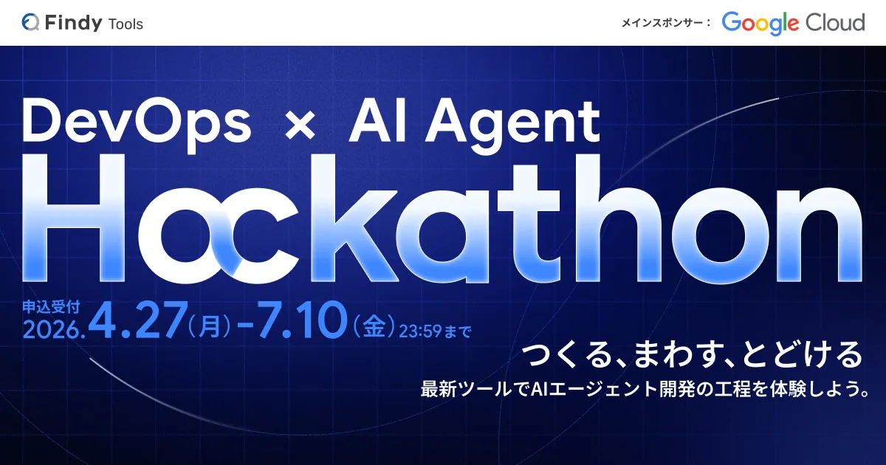
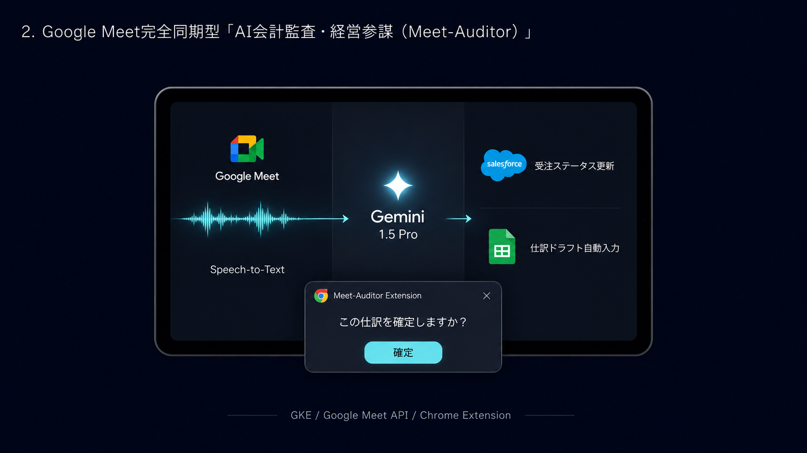
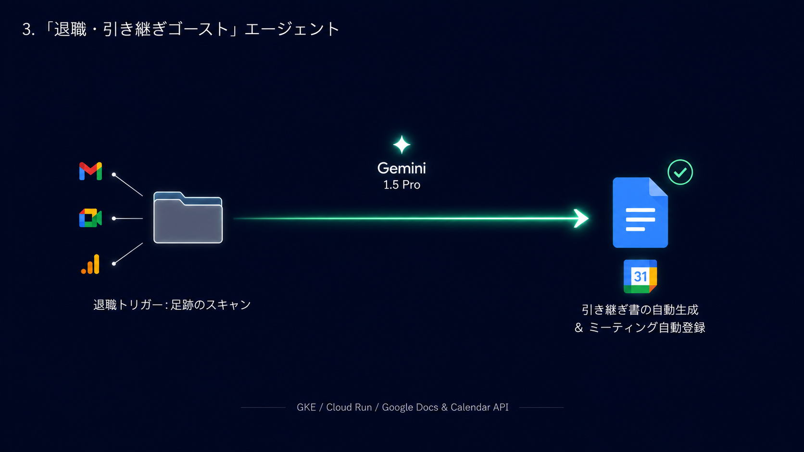
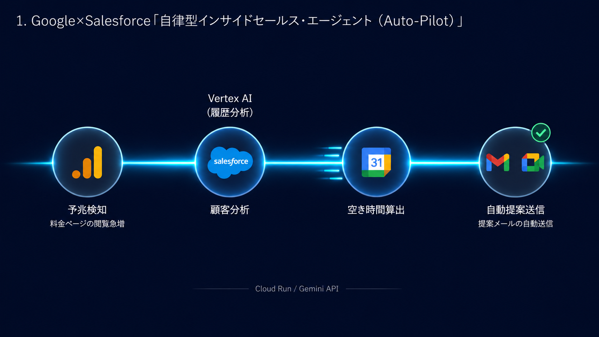

https://findy.notion.site/devops-ai-agent-hackathon-2026

---

## 🚀 プロジェクト・アイデア一覧 (全9製品)

### 1. [Meet-Auditor（ミート・オーディター）](./Meet-Auditor/README.md)

*   **概要:** 会議中の口頭での重要な意思決定（機材購入や発注など）をGeminiが自律的に検知し、Salesforceや会計スプレッドシートへ即時仕訳起票。経理担当者へChrome拡張でプッシュ通知し、確認するだけのHuman-in-the-Loop構成。
*   **技術スタック:** `Speech-to-Text`, `Gemini 1.5 Pro (Vertex AI)`, `GKE`, `Meet API`, `Chrome Extension`
*   **デモURL:** https://gemini-ops-orchestrator.web.app/Meet-Auditor/demo.html

---

### 2. [Legacy-Agent（レガシー・エージェント）](./legacy-agent/README.md)
*(※サムネイル画像なし)*

*   **概要:** ユーザーの日常活動を監視し、緊急事態を自律判定。膨大なGoogleドライブ内の書類から重要データ（口座・遺言等）のみを選別・構造化。さらに過去の日記等から「人格・感情」をエミュレートし、本人の声（TTS）で遺族へメッセージを自律配信。
*   **技術スタック:** `Cloud Run`, `Cloud Scheduler`, `Gemini 1.5 Pro`, `Vertex AI Search`, `Text-to-Speech API`, `Gmail/Calendar API`
*   **デモURL:** https://gemini-ops-orchestrator.web.app/legacy-agent/demo.html

---

### 3. [Subsidy-Navigator（サブシディ・ナビゲーター）](./subsidy-support-app/README.md)
*(※サムネイル画像なし)*

*   **概要:** ユーザーとのビジネスに関する日常の雑談をもとに、合致する公的補助金を自発的にマッチング提案。過去の採択パターンから申請書のドラフトを自動生成し、締切直前にはプッシュ通知で人間を徹底的かつ執念深く伴走・管理。
*   **技術スタック:** `Cloud Run`, `Gemini 1.5 Pro`, `Vertex AI Vector Search`, `Firebase Cloud Messaging`, `Flutter`, `Elasticsearch`
*   **デモURL:** https://gemini-ops-orchestrator.web.app/subsidy-support-app/demo.html

---

### 4. [Legacy-Ghost（レガシー・ゴースト）](./Legacy-Ghost/README.md)

*   **概要:** Salesforce上の「退職・休職」ステータスをトリガーに自律起動。前任者が遺したメールやMeet録画などから「仕事の魂（暗黙知・顧客の傾向）」を抽出し、完璧な引き継ぎ書（Google Docs）を自動生成。さらに後任のカレンダーに引き継ぎMTGを自動ねじ込み。
*   **技術スタック:** `GKE`, `Cloud Run`, `Gemini 1.5 Pro (Vertex AI)`, `Gmail/Drive/Docs/Calendar API`
*   **デモURL:** https://gemini-ops-orchestrator.web.app/Legacy-Ghost/demo.html

---

### 5. [Mental-Sparring-Partner（メンタル・スパーラー）](./empathy-partner/README.md)
*(※サムネイル画像なし)*

*   **概要:** 愚痴のループを検知すると、自律的に会話の主動権を握り、客観的メタ認知を促す鋭いスパーリング形式の問いを提示。ストレス危険域を検知するとアプリを強制終了させるセーフティ介入を実行。
*   **技術スタック:** `GKE`, `Gemini 1.5 Flash`, `Natural Language AI`, `Vertex AI Vector Search`, `Flutter`
*   **デモURL:** https://gemini-ops-orchestrator.web.app/empathy-partner/demo.html

---

### 6. [Auto-Pilot（オート・パイロット）](./Auto-Pilot/README.md)

*   **概要:** Webサイト（GA）での特定顧客の頻繁なアクセス等から「購買予兆」を自律検知。Salesforceから過去履歴を引き出し多角分析の上、100%パーソナライズされた提案メールを自動生成. さらにGoogle Meetの日程調整リンクを含めカレンダー連携で自動送信。
*   **技術スタック:** `Cloud Run`, `Gemini API`, `Vertex AI Vector Search`, `Gmail/Calendar/GA API`
*   **デモURL:** https://gemini-ops-orchestrator.web.app/Auto-Pilot/demo.html

---

### 7. [Trend-Launcher（トレンド・ランチャー）](./Trend-Launcher/README.md)

*   **概要:** Google Analyticsから「急上昇しているが自社にないキーワード（顧客の飢餓感）」を自律検知. 新商品の企画・仕様定義・会計ルール策定・Salesforceマスター登録・見込み顧客の自動アサインと営業チームへのプッシュ通知までを1時間サイクルで勝手に執行。
*   **技術スタック:** `Cloud Run`, `Cloud Scheduler`, `Gemini 1.5 Pro`, `Salesforce API`, `Google Sheets API`, `FCM`, `Flutter`
*   **デモURL:** https://gemini-ops-orchestrator.web.app/Trend-Launcher/demo.html

---

### 8. [Ad-Gazer（アド・ゲイザー）](./Ad-Gazer/README.md)

*   **概要:** 自社・競合のYouTube再生急上昇やコメント感情を24時間自律監視。市場の潜在ニーズを推論し、Google広告のキーワードや入札を自動最適化。さらに対象顧客へ動画付き提案メールをGmailで一斉送信。
*   **技術スタック:** `Cloud Run`, `Cloud Scheduler`, `Gemini Enterprise Agent Platform`, `YouTube API`, `Google Ads API`, `Gmail API`
*   **デモURL:** https://gemini-ops-orchestrator.web.app/Ad-Gazer/demo.html

---

### 9. [Claim-Converter（クレーム・コンバーター）](./Claim-Converter/README.md)

*   **概要:** クレームメールを感情分析で超高速に自律検知。Salesforceで顧客重要度を検索し、最適なYouTube解説動画を自動選定。動画が無い場合は、Geminiが即座に解決台本を執筆し、Imagen/TTSを連携して「専用解説動画」をその場で自律生成・アップロードして誠実返信。
*   **技術スタック:** `Cloud Functions`, `Gemini 1.5 Pro`, `Imagen API`, `Text-to-Speech API`, `YouTube Data API`, `Gmail API`
*   **デモURL:** https://gemini-ops-orchestrator.web.app/Claim-Converter/demo.html
