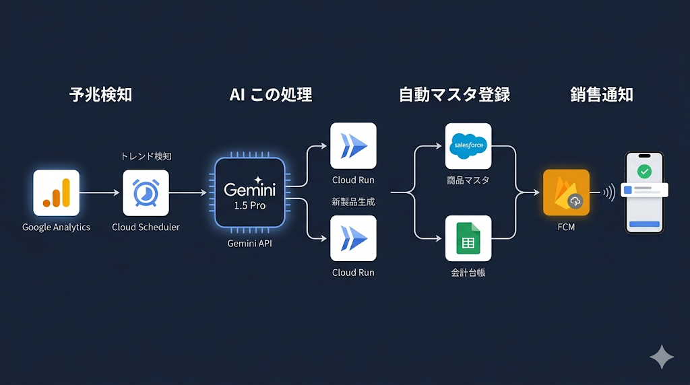

1. アナリティクス連動型「勝手に新商品ローンチ」エージェント
【ストーリー】 人間が市場調査をして商品開発する時代は終わり。AIがWebサイトの「未充足ニーズ」をデータから察知し、勝手にSalesforceの製品カタログに登録して営業を開始する。

⚙️ 実装プラン & アーキテクチャ
ステップ 1：予兆検知（Analytics → Cloud Run）

Cloud Schedulerで1時間に1回、Google Analytics Data APIを叩く。

検索キーワード（Search Query）や特定ページの滞在時間から、「急上昇しているが、自社サイトにコンテンツや商品がないキーワード（例：『〇〇機能 対応』など）」を抽出。

ステップ 2：商品企画・コード生成（Gemini API）

Gemini 1.5 Proにそのキーワードを投入。「このニーズを満たす新商品の名称、想定価格、製品仕様、会計用勘定科目（売上区分）」を自律生成させる。

ステップ 3：マスター自動登録（Cloud Run → Salesforce / Sheets）

生成されたデータを、Salesforce API経由で「Product2（商品）」オブジェクトに自動登録。価格表（PricebookEntry）も同時作成。

同時に、会計連携用のGoogleスプレッドシート（またはモック会計API）に、新しい商品コードと仕訳ルールを勝手に書き込む。

ステップ 4：営業へのプッシュ通知（Firebase）

Firebase Cloud Messaging (FCM) を使い、営業チームのスマホやSlack（Flutterアプリ）に「【自動ローンチ】『〇〇』という新商品をカタログに追加しました。すでに問い合わせが来ている顧客リスト（Salesforceから抽出）はコチラです」と通知。

